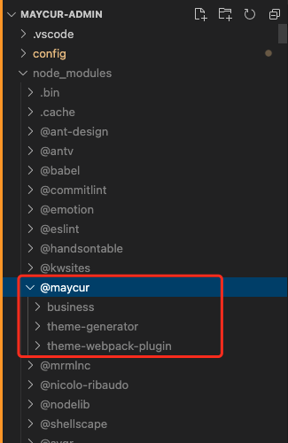

<!--
 * @Author: RongWei
 * @Date: 2021-09-20 11:21:19
 * @LastEditors: RongWei
 * @LastEditTime: 2021-09-27 21:11:09
 * @Description: file content
-->
## 如何生成 package.json 和 package-lock.json
Node.js 标准的软件包管理器，可以管理项目依赖的下载
`npm init` 交互式问答的方式生成 packahe.json
`npm init -y` 自动生成默认的 package.json
`npm install` 安装 package.json 中的依赖，并生成 package-lock.json, 锁住依赖及依赖的依赖的版本
`npm install <pkg-name>` 安装某个软件包
`npm update <pkg-name>` 更新某个软件包
`npm root -g` 全局安装包的位置

## [package.json](https://docs.npmjs.com/cli/v7/configuring-npm/package-json)
package.json 文件是项目的清单。它的内容没有固定的要求，满足 JSON 格式即可
- `name` 项目名称，命名有一定的规范。
  - 当在 npm 上发布包时，会成为 URL 的一部分，因此不能包含任何非 URL 安全字符；
  - 也可能会作为 require() 的参数传递
  - 有些包名会含有 [scope](https://docs.npmjs.com/cli/v7/using-npm/scope)

- `version` 当前的版本
**当需要发布包时，以上两个属性是及其重要而且必须的，它们一起构成了一个唯一的标识符**
- `description` 描述信息
- `keywords` 与包功能相关的关键字数组
**以上两个属性便于在 npm 库中搜索的时候发现你的模块，在 npm 搜索的时候会被列出来**
- `homepage` 项目的主页地址
- `scripts` 指定了运行脚本命令的 npm 命令行缩写
  ```
  // 当根目录下有 server.js 时, start 命令默认是执行 server.js
  "scripts": {"start": "node server.js"}
  ```

- `dependencies` 项目运行所依赖的模块，`npm install <pck> --save-prod`
- `devDependencies` 项目开发所需要的模块，通常是一些开发、测试、打包工具，如 babel、webpack、ESLint、jest等， `npm install <pck> --save-dev` 或 `npm install <pck> -D`
***需要设置 --production 标志（npm install --production），以避免安装这些开发依赖项***
- `peerDependencies` 应用运行依赖的宿主包，可以被对等安装
- `bin` 指定各个内部命令对应的可执行文件的位置，在编写 node 工具的时候一定会用到。例如 webpack 模块：
  ```
  // 当我们执行 webpack 命令的时候，执行的是 bin/webpack.js 文件中的代码
  // 在模块以依赖的方式被安装，如果存在 bin 选项，会在 node_modules/.bin/ 下生成对应的文件，npm 会寻找这个文件，在 node_modules/.bin/ 目录下建立符号链接。由于 node_modules/.bin/ 目录会在运行时加入系统的 PATH 变量，因此在运行 npm 时，就可以不带路径，直接通过命令来调用这些脚本。
  // 可执行文件需要以 `#!/usr/bin/env node` 开头
  "bin": {
    "webpack": "bin/webpack.js"
  }
  ```
- `main` 指定加载模块的入口文件，require() 导入的时候就会加载这个文件。默认值是模块根目录下的 index.js
- `private` 设置为 true，npm 将拒绝发布它，为了防止私有模块被无意间发布出去
- `repository` 指定代码存放地址，对想要为你的项目贡献代码的人有帮助
  ```
  "repository": {
    "type": "git",
    "url": "https://github.com/xxx/xxx.git"
  }
  ```
- `bugs` 用于项目问题的反馈 issue 地址或者一个邮箱
  ```
  // 如果提供了 url，则可以被 npm bugs 命令使用
  "bugs": {
    "url": "",
    "email": ""
  } 
  ```
- `license` 软件包的许可证
- `author` 作者
  ```
  "author": {
    "name": "rongwei",
    "email": "rongwei@maycur.com",
    "url": "https://xxxx.com"
  }

  "author": "rongwei rongwei@maycur.com https://xxxx.com"
  ```
- `contributors` 贡献者
```
{
  "contributors": [
    {
      "name": "rongwei",
      "email": "rongwei@maycur.com",
      "url": "https://xxxx.com"
    }
  ]
}
```
### peerDependencies
>peerDependencies 的目的是提示宿主环境去安装满足插件 peerDependencies 所指定依赖的包，然后在插件 import 或者 require 所依赖的包的时候，永远都是引用宿主环境统一安装的 npm 包，最终解决插件与所依赖包不一致的问题。

#### 为何要引入 peerDependencies
假设：
```
// maycur-business 和 maycur-antd package.json
"dependencies": {
  "classnames": "^2.2.5"
}
```
那么我们在 form-web 中执行 `npm install maycur-business` 会得到如下目录结构：
```
maycur-form-web
|- node_modules
   |- maycur-business
      |- classnames
   |- maycur-antd
      |- classnames
```
问题：
1、classnames 被多次安装
2、form-web 中无法直接使用 classnames，因为它没有被直接安装在 node_modules 目录下
为了解决这种问题，在 npm2 中引入了 peerDependencies
```
// maycur-business 和 maycur-antd package.json
"peerDependencies": {
  "classnames": "^2.2.5"
}
```
这时在 form-web 中执行 `npm install maycur-business` 会得到如下目录结构：
```
maycur-form-web
|- node_modules
   |- maycur-business
   |- maycur-antd
   |- classnames
```


### [scope](https://docs.npmjs.com/cli/v7/using-npm/scope)
scope 是一种将相关的模块组织到一起的一种方式。可以理解为作用域、命名空间，可以防止包重名
命名遵循 name 的规范，scope 前面是 @ 符号，后面是 /，如 `@somescope/somepackagename`，会被安装在 `node_modules/@somescope/somepackagename`下


scopes 和 包的可见性
- 包的可见性由包的 scope 和访问级别（公共或私有）来决定。
- 非 scope 的包总是公共的
- 私有包总是有作用域(scope)的
- 带有 scope 的包默认是私有的，当想发布一个公共模块时，必须要带有参数 `--access public`

#### 使用带有 scope 的模块
`const XX = require('@naycur/business')` 或者 
`import XX from '@maycur/business'`
会加载 node_modules/@maycur/business 模块

#### 发布带有 scope 的模块
`npm publish` 默认发布为私有模块，省略了 `--access restricted`， 要求必须有一个 npm 私有模块账户，可以选择自己搭建一个 npm 服务或者直接使用官方提供的服务，发布 user-scoped 或者 organization-scoped 的包
`npm publish --access public` 发布为共有模块

私有的 npm 包总是带有 scope，带有 scope 的包默认是私有的。

#### 将一个 scope 和一个仓库关联

举个🌰


### version 
语义版本控制（semver）
`x.y.z` 主版本.次版本.补丁版本
- 进行不兼容的 API 更改时，升级主版本
- 以向后兼容的方式添加功能时，升级次版本
- 进行向后兼容的方式修复缺陷时，升级补丁版本

>当主版本号升级后，次版本号和修订号需要重置为0，次版本号进行升级后，补丁版本需要重置为0。  

先行版本号（预发布号）：发布正式版之前的版本，格式是在补丁版本后加一个连接号，再加上一连串以点分割的标识符
```
1.0.0-alpha
1.0.0-alpha.1
1.0.0-0.3.7
```

更新版本时的规则：
- `^` 只会执行不更改最左边非零数字的更新，如 ^1.2.2 表示安装 1.x.x 的最新版本（不低于 1.2.2）; ^0.2.3 表示安装 0.2.x 的最新版本。使用 `npm install <pkg-name>`时，默认会加 ^ 
- `~` 更新到补丁版本，如 ～1.2.2 表示安装 1.2.x 的最新版本（不低于 1.2.2）
- `>`
- `>=`
- `<`
- `<=`
- `=`
- `-` 接受一定范围的版本，`2.1.0 - 2.6.2`
- `||` 组合集合 `< 2.1 || > 2.6`
- `tag` 
- `x`、`X`、`*` 通配符

### [npm version](https://docs.npmjs.com/cli/v7/commands/npm-version)
`npm version [<newversion> | major | minor | patch | premajor | preminor | prepatch | prerelease`
- 运行该命令会更改版本号，并将数据写入 package.json 和 package-lock.json
- 当在 git repo 中运行该命令时，会自动进行 git commit 操作并打标签 tag，可通过 `npm --no-git-tag-version version` 来禁止打标签。
- 运行该命令需要确保工作目录是干净的，可通过 `-f` 或者 `--force` 来跳过此操作

|npm version|功能|
|---|:--|
|major|- 如果没有预发布号，则直接升级一位大号，其他位都置为0；<br/>- 如果有预发布号：<br/>-- 中号和小号都为0，则不升级大号，而将预发布号删掉，即2.0.0-1变成2.0.0，这就是预发布的作用；<br/>-- 如果中号和小号有任意一个不是0，则会升级一位大号，其他位都置为0，清空预发布号。即 2.0.1-0变成3.0.0|
|minor|- 如果没有预发布号，则升级一位中号，大号不动，小号置为空<br/>- 如果有预发布号:<br/>-- 如果小号为0，则不升级中号，将预发布号去掉<br/>-- 如果小号不为0，升级中号，小号置空，同理没有预发布号|
|patch|- 如果没有预发布号：直接升级小号<br/>- 如果有预发布号：去掉预发布号，其他不动|
|premajor|- 直接升级大号，中号和小号置为0，增加预发布号为0|
|preminor|- 直接升级中号，小号置为0，增加预发布号为0|
|prepatch|- 直接升级小号，增加预发布号为0|
|prerelease|- 如果没有预发布号：增加小号，增加预发布号为0<br/>- 如果有预发布号，则升级预发布号|

### [scripts](https://docs.npmjs.com/cli/v7/using-npm/scripts)
`scripts` 属性支持大量内置的脚本及其预置的声明周期事件，可通过 `npm run-script <task-name>`（简写为 `npm run <task-name>`） 来执行。
匹配到 task-name 的 pre 和 post 命令也会执行
```
"scripts":{
  "prebuild": "{{ executes BEFORE the `build` script }}",
  "build": "{{ run command to build files }}",
  "postbuild": "{{ executes AFTER `build` script }}"
}
```

### 发布包
[npm publish](https://docs.npmjs.com/cli/v7/commands/npm-publish) 
`npm publish [<tarball>|<folder>] [--tag <tag>]`

- Publishes '.' if no argument supplied
- Sets tag 'latest' if no --tag specified` 
- `<tarball>|<folder>` 中一定包含 package.json
## [package-lock.json](https://docs.npmjs.com/cli/v7/configuring-npm/package-lock-json)
package-lock.json 会固化当前安装的每个软件包的版本
当运行 `npm update` 时，`package-lock.json` 中的软件包的版本会被更新
requires 字段指定了软件包的依赖，它们会按照字母顺序被添加到文件中，每个都有 `version` 字段，指向软件包位置的 `resolved` 字段，以及用于校验软件包的 `integrity` 字段

不同 npm 版本下 `npm install` 的规则
- `npm 5.0.x` 不管 package.json 中依赖是否更新， 都会根据 package-lock.json 下载
- `npm 5.1.0`后，当 package.json 中的依赖项有新版本时，`npm install` 会无视 package-lock.json 去下载新版本的依赖并更新 package-lock.json
- `5.4.2`版本后，
  - 如果只有一个 package.json 文件，运行 `npm i` 会根据它生成一个 package-lock.json 文件
  - 如果 package.json 的 `semver-range version` 和 package-lock.json 中版本兼容，即使 package.json 中有新的版本，也还是会根据 package-lock.json 下载
  - 如果手动修改了 package.json 的 version ranges，且和 package-lock.json 中版本不兼容，那么执行 `npm i` 时 package-lock.json 将会更新到兼容 package.json 的版本

### 查看 npm 包安装的版本
`npm list` 也可以打开 package-lock.json 文件查看
`npm list -g` 适用于全局安装的软件包
`npm list --depth=0` 仅获取顶层的软件包，package.json 中列出的软件包
`npm list <pkg-name>` 获取特定软件包的版本，也适用于安装的软件包的依赖
`npm view <pkg-name> version` 查看软件包在 npm 仓库上的最新可用版本
`npm view <pkg-name> versions` 查看软件包在 npm 仓库上的所有版本
`npm outdated` 发觉软件包的新版本

### 安装包的旧版本
`npm install <package>@<version>`

package-lock冲突时如何解决？


参考文献
- [npm Docs](https://docs.npmjs.com/)
- [npm的package.json和package-lock.json更新策略](https://blog.csdn.net/weixin_43820866/article/details/105232066)

